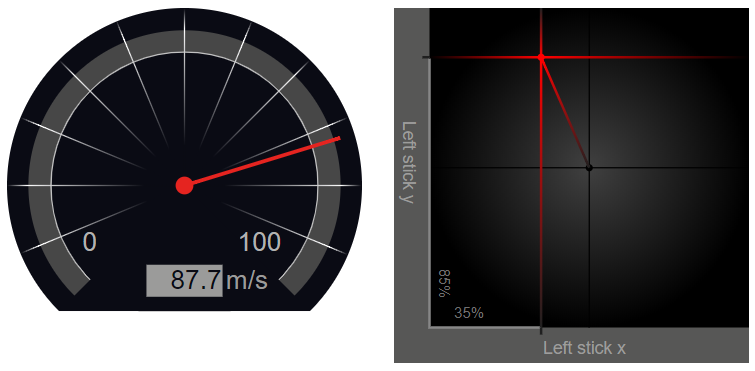

# Angular Pro Widgets

See the [documentation](https://ngfelixl.github.io/pro-widgets)



Currently available widgets:

- Gauge
- Digital Gauge
- Analog Stick

more widgets coming soon. Widget ideas welcome.

## Installation 

```
npm install pro-widgets
```

## Import the module and use

```typescript
import { ProModule } from 'pro-widgets';

@NgModule({
  import: [ ProModule ]
})
export class AppModule {}
```

Use the widget in your component template by

```html
<pro-gauge [value]="stream$ | async"></pro-gauge>
<pro-analog-stick></pro-analog-stick>
```

## Get in touch

[](https://twitter.com/intent/follow?screen_name=ngfelixl)
[](https://github.com/ngfelixl)

Hi, I am Felix,
Software developer and Angular, NgRX contributor


If you like this library, think about giving it a star or follow me on twitter or github or check out my personal
the [website](https://felixlemke.com).